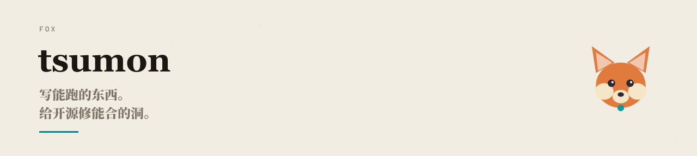

<picture>
  <source media="(prefers-color-scheme: dark)" srcset="./assets/hero-dark.svg" />
  
</picture>

<h1 align="center">tsumon</h1>

  <strong>Build useful systems. Leave clean diffs.</strong> 
  写能跑的东西，给开源修能合的洞。

  
  
  
  

<table width="100%">
  <tr>
    <td width="55%" valign="top">
      <strong>What I work on</strong> 
      Agent workflows, developer tools, local-first utilities and the awkward edges between a model and a real product.
    </td>
    <td width="45%" valign="top">
      <strong>How I contribute</strong> 
      Small, reviewable changes that fix an actual problem and can survive CI, code review and daily use.
    </td>
  </tr>
</table>

 

<h2 align="center">Featured work</h2>

  <h3><a href="https://tsumon.github.io">看得见的大模型</a></h3>
  
<strong>把大模型讲到能看懂，也讲到能动手。</strong> 工程铺地，数学捡石，模型走路。

  

    
  

  
<a href="https://tsumon.github.io">进入图解书 →</a>

 

<picture>
  <source media="(prefers-color-scheme: dark)" srcset="https://raw.githubusercontent.com/tsumon/tsumon/output/github-contribution-grid-snake-dark.svg" />
  <source media="(prefers-color-scheme: light)" srcset="https://raw.githubusercontent.com/tsumon/tsumon/output/github-contribution-grid-snake.svg" />
  
</picture>

<h2 align="center">Selected projects</h2>

These are the things I keep close: small enough to understand, useful enough to keep improving.

<table width="100%">
  <tr>
    <th width="260">Project</th>
    <th width="610">What it does</th>
    <th width="180">Stars</th>
  </tr>
  <tr>
    <td><a href="https://github.com/tsumon/reminder-app-ios">循环提醒</a> <a href="https://github.com/tsumon/reminder-app-android">iOS · Android</a></td>
    <td>到期确认才进下一周期；没确认就 1h→4h→12h→24h 再响。</td>
    <td></td>
  </tr>
  <tr>
    <td><a href="https://github.com/tsumon/suite">Suite</a></td>
    <td>Windows 托盘：F1 截图、任务栏网速、透明和深浅色。</td>
    <td></td>
  </tr>
  <tr>
    <td><a href="https://github.com/tsumon/StreamDock">StreamDock</a></td>
    <td>单二进制 Emby 反代面板。明文导入导出，独立流量页。</td>
    <td></td>
  </tr>
  <tr>
    <td><a href="https://github.com/tsumon/skill-mcp">skill-mcp</a></td>
    <td>本地 stdio MCP。最多绑 3 个 <code>SKILL.md</code>，token 预算加不了名额。</td>
    <td></td>
  </tr>
  <tr>
    <td><a href="https://github.com/tsumon/auto-cs-agent-sft-dpo">汽车售后客服</a></td>
    <td>Qwen2.5-7B 的 SFT + DPO。真正能上线的是推理期约束层。</td>
    <td></td>
  </tr>
  <tr>
    <td><a href="https://github.com/tsumon/agentflow">AgentFlow</a></td>
    <td>Plan → Execute → Review。三个 agent 按序办事。</td>
    <td></td>
  </tr>
  <tr>
    <td><a href="https://tsumon.github.io">看得见的大模型</a></td>
    <td>图解书。工程铺地，数学捡石，模型走路。</td>
    <td></td>
  </tr>
</table>

<h2 align="center">Open-source contribution log</h2>

Real issues, real review queues, real CI. Entries are discovered from my external GitHub PRs and sorted by outcome, then repository name. Status badges are synced from GitHub every day.

<table width="100%">
  <tr>
    <th width="260">Repository</th>
    <th width="610" align="center">Contribution</th>
    <th width="180">Status</th>
  </tr>
  <!-- contribution-log:rows:start -->
  <tr>
    <td colspan="3" align="center"><strong>MERGED</strong> landed upstream</td>
  </tr>
  <tr>
        <td><a href="https://github.com/open-webui/open-webui">open-webui/ <strong>open-webui</strong></a></td>
        <td>简体中文 i18n 翻译改进。</td>
        <td></td>
      </tr>
  <tr>
        <td><a href="https://github.com/processing/p5.js">processing/ <strong>p5.js</strong></a></td>
        <td>修复 p5.strands 单参数箭头函数解析，解决 <a href="https://github.com/processing/p5.js/issues/9180">#9180</a>。</td>
        <td></td>
      </tr>
  <tr>
        <td><a href="https://github.com/zhayujie/CowAgent">zhayujie/ <strong>CowAgent</strong></a></td>
        <td>控制台侧栏版本号一键源码更新，修 <a href="https://github.com/zhayujie/CowAgent/issues/3148">#3148</a>。</td>
        <td></td>
      </tr>
  <tr>
        <td><a href="https://github.com/zhayujie/CowAgent">zhayujie/ <strong>CowAgent</strong></a></td>
        <td>钉钉收文件，交给 agent。</td>
        <td></td>
      </tr>
  <tr>
        <td><a href="https://github.com/zhayujie/CowAgent">zhayujie/ <strong>CowAgent</strong></a></td>
        <td>钉钉流式 markdown 卡片。</td>
        <td></td>
      </tr>
  <tr>
        <td><a href="https://github.com/zhayujie/CowAgent">zhayujie/ <strong>CowAgent</strong></a></td>
        <td>LLM 流式输出期间探测 steer inbox。</td>
        <td></td>
      </tr>
  <tr>
    <td colspan="3" align="center"><strong>IN REVIEW</strong> awaiting maintainer review</td>
  </tr>
  <tr>
        <td><a href="https://github.com/666ghj/BettaFish">666ghj/ <strong>BettaFish</strong></a></td>
        <td>PDF 导出文件名防路径穿越。</td>
        <td></td>
      </tr>
  <tr>
        <td><a href="https://github.com/anthropics/anthropic-sdk-python">anthropics/ <strong>anthropic-sdk-python</strong></a></td>
        <td>fix(streaming): keep stop_* when a later message_delta omits them</td>
        <td></td>
      </tr>
  <tr>
        <td><a href="https://github.com/anthropics/sandbox-runtime">anthropics/ <strong>sandbox-runtime</strong></a></td>
        <td>区分 whichSync 超时与二进制不存在。</td>
        <td></td>
      </tr>
  <tr>
        <td><a href="https://github.com/anthropics/sandbox-runtime">anthropics/ <strong>sandbox-runtime</strong></a></td>
        <td>仅当正文实际变化时才保留 Content-Length 处理。</td>
        <td></td>
      </tr>
  <tr>
        <td><a href="https://github.com/anthropics/sandbox-runtime">anthropics/ <strong>sandbox-runtime</strong></a></td>
        <td>feat: deny unlink/rename inside write-allowed paths</td>
        <td></td>
      </tr>
  <tr>
        <td><a href="https://github.com/huggingface/huggingface_hub">huggingface/ <strong>huggingface_hub</strong></a></td>
        <td>将 concepts/git_vs_http 翻译为简体中文。</td>
        <td></td>
      </tr>
  <tr>
        <td><a href="https://github.com/openai/openai-agents-js">openai/ <strong>openai-agents-js</strong></a></td>
        <td>流式 abort reconciliation 补齐 computer_call。</td>
        <td></td>
      </tr>
  <tr>
        <td><a href="https://github.com/openclaw/openclaw">openclaw/ <strong>openclaw</strong></a></td>
        <td>握手时从客户端授予 markdownDetails，不再从 channel name 推断。</td>
        <td></td>
      </tr>
  <tr>
        <td><a href="https://github.com/OpenHands/OpenHands">OpenHands/ <strong>OpenHands</strong></a></td>
        <td>README Node.js 版本与 engines.node 对齐。</td>
        <td></td>
      </tr>
  <tr>
        <td><a href="https://github.com/stablyai/orca">stablyai/ <strong>orca</strong></a></td>
        <td>Dashboard 别把还活着的 structured chat 当成死终端。</td>
        <td></td>
      </tr>
  <tr>
        <td><a href="https://github.com/stablyai/orca">stablyai/ <strong>orca</strong></a></td>
        <td>修复 git username 探测超时时静默丢失前缀。</td>
        <td></td>
      </tr>
  <tr>
        <td><a href="https://github.com/Tencent/WeKnora">Tencent/ <strong>WeKnora</strong></a></td>
        <td>fix(wiki): stop deleted tenants from scheduling generation</td>
        <td></td>
      </tr>
  <tr>
        <td><a href="https://github.com/zhayujie/CowAgent">zhayujie/ <strong>CowAgent</strong></a></td>
        <td>Web / 桌面配置 MCP 和 skills，修 <a href="https://github.com/zhayujie/CowAgent/issues/3114">#3114</a>。</td>
        <td></td>
      </tr>
  <tr>
        <td><a href="https://github.com/zhayujie/CowAgent">zhayujie/ <strong>CowAgent</strong></a></td>
        <td>feat(docker): add optional Agent Mail compose profile</td>
        <td></td>
      </tr>
  <!-- contribution-log:rows:end -->
</table>

<h2 align="center">Current direction</h2>

<table width="100%">
  <tr>
    <td width="260"><strong>Agent harness</strong></td>
    <td width="800">让 Plan → Execute → Review 变成可以观察、可以重试、可以交付的流程。</td>
  </tr>
  <tr>
    <td width="260"><strong>RAG / MCP</strong></td>
    <td width="800">把上下文、工具和 token 预算放回工程约束，而不是只停留在 demo。</td>
  </tr>
  <tr>
    <td width="260"><strong>Product edges</strong></td>
    <td width="800">智能客服、舆情分析、桌面工具，以及模型真正接触用户之后暴露出来的问题。</td>
  </tr>
</table>

  <a href="https://github.com/tsumon?tab=repositories">repositories</a>
  · <a href="https://tsumon.github.io">看得见的大模型</a>
  · <a href="https://github.com/tsumon/tsumon/issues">say hello</a>

